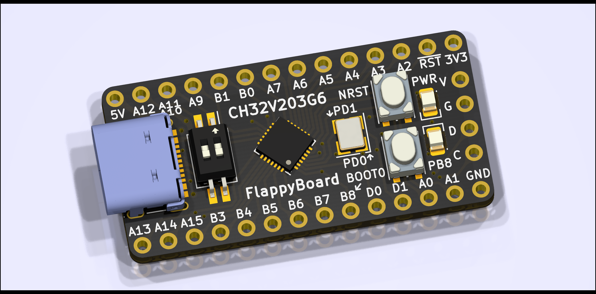
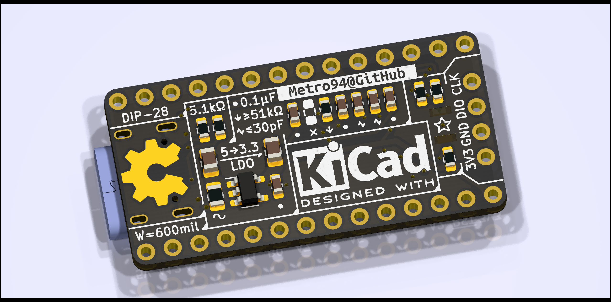

[中文](README_zh.md) | English

# FlappyBoard

## Introduction

A minimum development board for CH32V203G6. The goal is simplicity, convenience and low-cost.

## 3D Rendering View

## License

[CERN-OHL-P](LICENSE)

## EDA

KiCad 6.0.6

## Usages

### Download Programs

It's simple and convenient to use USB download of [WCHISPTool](http://www.wch-ic.com/downloads/WCHISPTool_Setup_exe.html). Also serial download and debug port download is available.

WCHISTool requires correct MCU model (CH32V203) to download. The DIP switch shall be ON for downloading, and power the board with BOOT0 button pushed. If everything goes well, WCHISPTool shall report the MCU.

### LEDs and Buttons

There are two LEDs on the board, including *PWR* for power status (3.3V powered) and *PB8* for user-defined LED.

There are two buttons on the board, including *NRST* for system reset and *BOOT0* for boot mode (the default is to run user program in Flash, and push button to run bootloader in ROM).

> Note: In CH32V203G6, *PB8* and *BOOT0* is multiplexed. The behavior of this pin is:
>
> * When booting, MCU requires *BOOT0* status via this pin, and this pin is input. When *BOOT0* button is pushed, the LED of *PB8* is lighted to hint.
> * After entering user program, the *PB8* pin is available for output only, and the input value is invalid. Now, the LED of *PB8* can be controlled by user program, but the status of *BOOT0* button cannot be read.

### External Clock Input

CH32V203G6 can accept external oscillator and crystal. The valid frequency range is 3-25MHz.

### Schematics

[FlappyBoard Schematic](schematics/FlappyBoard.pdf)

### BOM

[FlappyBoard BOM](https://metro94.github.io/FlappyBoard/bom.html)

### Examples

[software/examples](software/examples)
